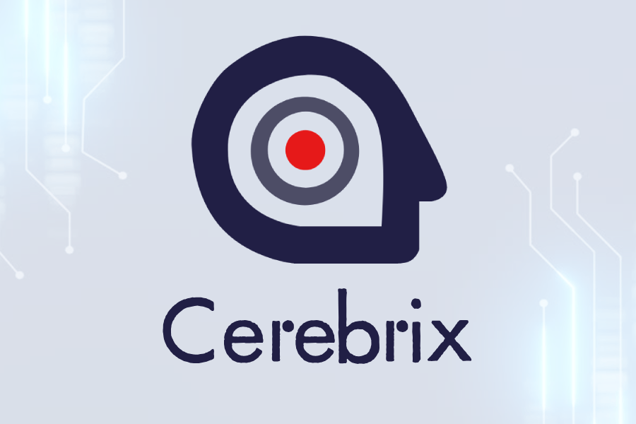
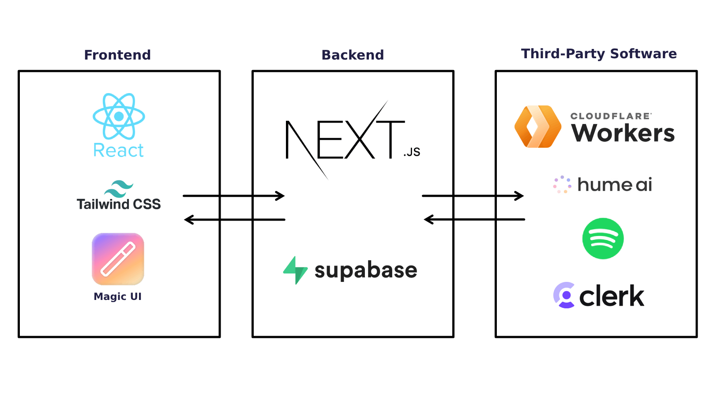

<!-- Improved compatibility of back to top link: See: https://github.com/aw4630/hackru-2024/pull/73 -->
<a id="readme-top"></a>
<!--
*** Thanks for checking out the Best-README-Template. If you have a suggestion
*** that would make this better, please fork the repo and create a pull request
*** or simply open an issue with the tag "enhancement".
*** Don't forget to give the project a star!
*** Thanks again! Now go create something AMAZING! :D
-->


<!-- PROJECT SHIELDS -->
<!--
*** I'm using markdown "reference style" links for readability.
*** Reference links are enclosed in brackets [ ] instead of parentheses ( ).
*** See the bottom of this document for the declaration of the reference variables
*** for contributors-url, forks-url, etc. This is an optional, concise syntax you may use.
*** https://www.markdownguide.org/basic-syntax/#reference-style-links
-->
[![Contributors][contributors-shield]][contributors-url]
[![Forks][forks-shield]][forks-url]
[![Stargazers][stars-shield]][stars-url]
[![Issues][issues-shield]][issues-url]
[![MIT License][license-shield]][license-url]


<!-- PROJECT LOGO -->
<br />
<div align="center">

<a href="https://github.com/aw4630/hackru-2024">
    
  </a>

  <p align="center">
    Engaging minds, empowering caretakers: adaptive games for cognitive wellness.
    <br />
    <a href="https://github.com/aw4630/hackru-2024/issues/new?labels=bug&template=bug-report---.md">Report Bug</a>
    ·
    <a href="https://github.com/aw4630/hackru-2024/issues/new?labels=enhancement&template=feature-request---.md">Request Feature</a>
  </p>
</div>


<!-- TABLE OF CONTENTS -->
<details>
  <summary>Table of Contents</summary>
  <ol>
    <li>
      <a href="#about-the-project">About The Project</a>
      <ul>
        <li><a href="#built-with">Built With</a></li>
      </ul>
    </li>
    <li>
      <a href="#get-started">Get Started</a>
    </li>
    <li><a href="#license">License</a></li>
    <li><a href="#contact">Contact</a></li>
    <li><a href="#acknowledgments">Acknowledgments</a></li>
  </ol>
</details>


<!-- ABOUT THE PROJECT -->
## About The Project

[![Product Name Screen Shot][product-screenshot]](https://github.com/aw4630/hackru-2024/blob/main/hackru-2024-logo.png)

Cerebrix has a set of brain-stimulating minigames crafted for dementia and Alzheimer's patients, designed to encourage mental engagement through familiar and accessible activities. The suite includes games like card memory matching, a recognition game where users match aquaintences to their names, and a math challenge. Each minigame adapts its difficulty based on the player’s recent performance, creating a personalized experience that stays challenging yet manageable. This adaptive design aims to support memory retention, recognition skills, and cognitive stimulation in a gentle, supportive way. It additionally contains a voice-to-voice AI companion that the player can talk to for social activity and emotional support, and a minigame to guess the musical instrument playing in a song.

A caretaker sets up and manages the patient’s account, personalizing it to enhance relevance and usability. They can also monitor cognitive changes over time, as the application tracks game performance and provides feedback on any progress or cognitive shifts. This feature enables caretakers to observe patterns and receive insights. By combining engaging gameplay with helpful progress tracking, this project aims to support both patients and caretakers in their experience with dementia care.


### How it works

We used React.js/Next.js and Vercel to build the application, using a Cloudflare Worker running Meta Llama 3 for generation of math problems, Clerk and Supabase for authentication and users, Spotify API for the musical instrument guessing game, and Hume AI for the voice-to-voice AI.



The cognitive progress or decline is measured by accuracy in the games over time, which is stored in the Supabase database.


<p align="right">(<a href="#readme-top">back to top</a>)</p>


### Built With

* [![Next.js][Next.js]][Next-url]
* [![React][React.js]][React-url]
* [![Tailwind][Tailwind]][Tailwind-url]
* [![Cloudflare][Cloudflare]][Cloudflare-url]
* [![Hume][Hume]][Hume-url]
* [![Supabase][Supabase]][Supabase-url]
* [![Clerk][Clerk]][Clerk-url]
* [![Spotify][Spotify]][Spotify-url]

Programmed in
* [![TypeScript][TypeScript]][TypeScript-url]
  
Powered by
* [![Vercel][Vercel]][Vercel-url]

<p align="right">(<a href="#readme-top">back to top</a>)</p>


## Get started

Here are the steps to run the project locally if you want to develop your own project.

### Prerequisites

* npm
  ```sh
  npm install npm@latest -g
  ```

You can run the project using 
```sh
npm run server
```


<!-- LICENSE -->
## License

Distributed under the MIT License. See `LICENSE.txt` for more information.

<p align="right">(<a href="#readme-top">back to top</a>)</p>


<!-- CONTACT -->
## Contact

Joseph Helfenbein - [![linkedin][linkedin-shield]][JoeLinkedin-url]

Alan Wu - [![linkedin][linkedin-shield]][AlanLinkedin-url]

Mike Odnis - [![linkedin][linkedin-shield]][MikeLinkedin-url]

Radwan Hoque - [![linkedin][linkedin-shield]][RadwanLinkedin-url]

Project Link: [https://github.com/aw4630/hackru-2024](https://github.com/aw4630/hackru-2024)

<p align="right">(<a href="#readme-top">back to top</a>)</p>


<!-- ACKNOWLEDGMENTS -->
## Acknowledgments

This project was submitted to the HackRU 2024 hackathon for the NeuroTech track.

Devpost link: https://devpost.com/software/cerebrix

* [Best README Template](https://github.com/othneildrew/Best-README-Template)

<p align="right">(<a href="#readme-top">back to top</a>)</p>


<!-- MARKDOWN LINKS & IMAGES -->
<!-- https://www.markdownguide.org/basic-syntax/#reference-style-links -->
[contributors-shield]: https://img.shields.io/github/contributors/aw4630/hackru-2024.svg?style=for-the-badge
[contributors-url]: https://github.com/aw4630/hackru-2024/graphs/contributors
[forks-shield]: https://img.shields.io/github/forks/aw4630/hackru-2024.svg?style=for-the-badge
[forks-url]: https://github.com/aw4630/hackru-2024/network/members
[stars-shield]: https://img.shields.io/github/stars/aw4630/hackru-2024.svg?style=for-the-badge
[stars-url]: https://github.com/aw4630/hackru-2024/stargazers
[issues-shield]: https://img.shields.io/github/issues/aw4630/hackru-2024.svg?style=for-the-badge
[issues-url]: https://github.com/aw4630/hackru-2024/issues
[license-shield]: https://img.shields.io/github/license/aw4630/hackru-2024.svg?style=for-the-badge
[license-url]: https://github.com/aw4630/hackru-2024/blob/master/LICENSE.txt
[linkedin-shield]: https://img.shields.io/badge/-LinkedIn-black.svg?style=for-the-badge&logo=linkedin&colorB=555
[linkedin-url]: https://linkedin.com/in/othneildrew
[product-screenshot]: https://github.com/aw4630/hackru-2024/blob/main/product-screenshot.png
[Next.js]: https://img.shields.io/badge/next.js-000000?style=for-the-badge&logo=nextdotjs&logoColor=white
[Next-url]: https://nextjs.org/
[React.js]: https://img.shields.io/badge/React.js-20232A?style=for-the-badge&logo=react&logoColor=61DAFB
[React-url]: https://reactjs.org/
[Vue.js]: https://img.shields.io/badge/Vue.js-35495E?style=for-the-badge&logo=vuedotjs&logoColor=4FC08D
[Vue-url]: https://vuejs.org/
[Angular.io]: https://img.shields.io/badge/Angular-DD0031?style=for-the-badge&logo=angular&logoColor=white
[Angular-url]: https://angular.io/
[Svelte.dev]: https://img.shields.io/badge/Svelte-4A4A55?style=for-the-badge&logo=svelte&logoColor=FF3E00
[Svelte-url]: https://svelte.dev/
[Laravel.com]: https://img.shields.io/badge/Laravel-FF2D20?style=for-the-badge&logo=laravel&logoColor=white
[Laravel-url]: https://laravel.com
[Bootstrap.com]: https://img.shields.io/badge/Bootstrap-563D7C?style=for-the-badge&logo=bootstrap&logoColor=white
[Bootstrap-url]: https://getbootstrap.com
[JQuery.com]: https://img.shields.io/badge/jQuery-0769AD?style=for-the-badge&logo=jquery&logoColor=white
[JQuery-url]: https://jquery.com 
[Expo]: https://img.shields.io/badge/expo-000000?style=for-the-badge&logo=expo&logoColor=white
[Expo-url]: https://expo.dev/
[Flask]: https://img.shields.io/badge/flask-4590A1?logo=flask&style=for-the-badge&logoColor=white
[Flask-url]: https://flask.palletsprojects.com/en/3.0.x/
[JavaScript]: https://img.shields.io/badge/javascript-yellow?logo=javascript&style=for-the-badge&logoColor=white
[JavaScript-url]: https://developer.oracle.com/languages/javascript.html
[ThreeJS]: https://img.shields.io/badge/three.js-black?logo=three.js&style=for-the-badge&logoColor=white
[ThreeJS-url]: https://threejs.org/
[TypeScript]: https://img.shields.io/badge/typescript-3178C6?logo=typescript&style=for-the-badge&logoColor=white
[TypeScript-url]: https://www.typescriptlang.org/
[Python]: https://img.shields.io/badge/python-3776AB?style=for-the-badge&logo=python&logoColor=white
[Python-url]: https://www.python.org/
[Amazon-RDS]: https://img.shields.io/badge/amazon%20rds-527FFF?style=for-the-badge&logo=amazon%20rds&logoColor=white
[Amazon-RDS-url]: https://aws.amazon.com/rds/
[Cloudflare]: https://img.shields.io/badge/cloudflare%20workers-F38020?style=for-the-badge&logo=cloudflare%20workers&logoColor=white
[Cloudflare-url]: https://workers.cloudflare.com/
[Vercel]: https://img.shields.io/badge/vercel-000000?logo=vercel&style=for-the-badge&logoColor=white
[Vercel-url]: https://www.vercel.com/
[JoeLinkedin-url]:https://www.linkedin.com/in/joseph-j-helfenbein/
[MikeLinkedin-url]: https://www.linkedin.com/in/mikeodnis
[AlanLinkedin-url]: https://www.linkedin.com/in/aw4630/
[RadwanLinkedin-url]: https://www.linkedin.com/in/radwan-hoque-83988626a/
[Supabase]: https://img.shields.io/badge/supabase-3FCF8E?logo=supabase&style=for-the-badge&logoColor=white
[Supabase-url]: https://supabase.com/
[Clerk]: https://img.shields.io/badge/clerk-6C47FF?logo=clerk&style=for-the-badge&logoColor=white
[Clerk-url]: https://clerk.com/
[Hume]: https://img.shields.io/badge/Hume%20AI-000000.svg?logo=data:image/svg%2bxml;base64,PHN2ZyB4bWxuczp4bGluaz0iaHR0cDovL3d3dy53My5vcmcvMTk5OS94bGluayIgeG1sbnM9Imh0dHA6Ly93d3cudzMub3JnLzIwMDAvc3ZnIiB2aWV3Qm94PSIwIDAgMTIwMCAxMjAwIiBmaWxsPSJub25lIiB3aWR0aD0iODAiIGhlaWdodD0iODAiPgogICAgPHBhdGggZD0iTTI0Mi45NDMgNjA0Ljc0NkMyMDEuMDc3IDYxNC4zNTkgMTc1LjAyNCA2NTMuOTUgMTg1LjIwNiA2OTYuMzg3QzE5NC44MiA3MzguODIxIDIzNS41NDggNzYzLjczOCAyNzYuODQ2IDc1NC4xMjJDMzE4LjcxMiA3NDQuNTEgMzQ0LjE5NiA3MDQuOTE4IDMzNC41ODIgNjYyLjQ4NEMzMjQuOTY5IDYxOS45OTMgMjg0LjI0MSA1OTUuMTM0IDI0Mi45NDMgNjA0Ljc0NloiIGZpbGw9IiNGRkI1RDYiLz4KICAgIDxwYXRoIGQ9Ik0yNzkuMDkzIDQ0NC41OTlDMzEyLjQ4NCA0NzEuMjIgMzU5LjQxMyA0NjYuNjcgMzg2LjYwMyA0MzIuNzFDNDEzLjczNiAzOTguNzUgNDA3LjUzNiAzNTEuODIyIDM3NC43MTUgMzI1LjJDMzQxLjg5MyAyOTguNTc5IDI5NC4zMzggMzAzLjEyOSAyNjcuMjA1IDMzNy4wODlDMjQwLjA3MSAzNzEuMDQ4IDI0Ni4yNzIgNDE3Ljk3NyAyNzkuMDkzIDQ0NC41OTlaIiBmaWxsPSIjRDJBN0U5Ii8+CiAgICA8cGF0aCBkPSJNNDgxLjY4NiA4NDYuOTEyQzQ0Mi42NjQgODI4LjI1NSAzOTcuOTUzIDg0NC4wNjkgMzc5LjI5NiA4ODIuNThDMzYwLjYzOCA5MjEuMDMyIDM3NS44ODMgOTY1Ljc0NCA0MTQuOTYyIDk4NC45NjlDNDUzLjk4NCAxMDAzLjYzIDQ5OC42OTQgOTg3LjgxNSA1MTcuMzUyIDk0OS4zMDRDNTM1LjQ0MSA5MTAuMjgxIDUyMC43NjUgODY1LjU3MiA0ODEuNjg2IDg0Ni45MTJaIiBmaWxsPSIjRkZEQ0RDIi8+CiAgICA8cGF0aCBkPSJNNzE3LjA0NSA4NDYuODc5QzY3OC4wMjQgODY1LjUzNSA2NjIuNzIgOTEwLjgxNSA2ODEuMzggOTQ5LjI2OEM3MDAuMDM3IDk4Ny43MjMgNzQ0LjE3OCAxMDA0LjE2IDc4My43NjkgOTg0LjkzNUM4MjIuNzkzIDk2Ni4yNzkgODM4LjA5NCA5MjAuOTk5IDgxOS40MzcgODgyLjU0NkM4MDAuNzc3IDg0NC4wOTEgNzU2LjEyNiA4MjcuNjUxIDcxNy4wNDUgODQ2Ljg3OVoiIGZpbGw9IiNGRkQxQTQiLz4KICAgIDxwYXRoIGQ9Ik05NTUuODY2IDYwNC43NDNDOTE0IDU5NS4xMzEgODczLjg0MSA2MjAuMDQ3IDg2NC4yMjggNjYyLjQ4MUM4NTQuNjEzIDcwNC45MTUgODgwLjA5NyA3NDUuMDc0IDkyMS45NjMgNzU0LjExOUM5NjMuODI5IDc2My43MzQgMTAwMy45OSA3MzguODE4IDEwMTMuNiA2OTYuMzg0QzEwMjMuMjIgNjUzLjk1IDk5Ny43MzIgNjE0LjM1OSA5NTUuODY2IDYwNC43NDNaIiBmaWxsPSJ1cmwoI3BhaW50MF9saW5lYXJfMjQzXzIpIi8+CiAgICA8cGF0aCBkPSJNOTMwLjM4OSA0NDQuNjY3Qzk2My43ODIgNDE4LjA0NSA5NjkuNDEyIDM3MS4xMTYgOTQyLjI3OSAzMzcuMTU2QzkxNS4xNDYgMzAzLjE5NyA4NjguMTU5IDI5OC43MDMgODM0Ljc3IDMyNS4yNjhDODAxLjM3NyAzNTEuODkgNzk1Ljc0NiAzOTguODE4IDgyMi44NzkgNDMyLjc3OEM4NTAuMDcgNDY2LjczNyA4OTYuOTk5IDQ3MS4yMzEgOTMwLjM4OSA0NDQuNjY3WiIgZmlsbD0iI0EwQjBGNiIvPgogICAgPHBhdGggZD0iTTU5OS4zODQgMTc3QzU1NS4yMzkgMTc3IDUyMi40MTggMjEwLjk1OSA1MjIuNDE4IDI1My45NjNDNTIyLjQxOCAyOTYuOTY3IDU1NS4yMzkgMzMwLjkyNyA1OTkuMzg0IDMzMC45MjdDNjQyLjk1MyAzMzAuOTI3IDY3Ni4zNDYgMjk2Ljk2NyA2NzYuMzQ2IDI1My45NjNDNjc2LjI4OCAyMTAuOTAyIDY0Mi45NTMgMTc3IDU5OS4zODQgMTc3WiIgZmlsbD0iI0JCQUJFRCIvPgogICAgPGRlZnM+CiAgICAgICAgPGxpbmVhckdyYWRpZW50IGlkPSJwYWludDBfbGluZWFyXzI0M18yIiB4MT0iOTE3LjAyIiB5MT0iNzUzLjE1MiIgeDI9Ijk1OS40OTgiIHkyPSI2MTAuMTM1IiBncmFkaWVudFVuaXRzPSJ1c2VyU3BhY2VPblVzZSI+CiAgICAgICAgICAgIDxzdG9wIG9mZnNldD0iMC4yNjU2IiBzdG9wLWNvbG9yPSIjRkZCN0IyIi8+CiAgICAgICAgICAgIDxzdG9wIG9mZnNldD0iMC41NzgxIiBzdG9wLWNvbG9yPSIjQUI5RUZDIi8+CiAgICAgICAgPC9saW5lYXJHcmFkaWVudD4KICAgIDwvZGVmcz4KPC9zdmc+Cg==&style=for-the-badge
[Hume-url]: https://www.hume.ai/
[Spotify]: https://img.shields.io/badge/spotify%20api-1DB954?logo=spotify&style=for-the-badge&logoColor=white
[Spotify-url]: https://developer.spotify.com/documentation/web-api
[Tailwind]: https://img.shields.io/badge/tailwind%20css-06B6D4?logo=tailwindcss&style=for-the-badge&logoColor=white
[Tailwind-url]: https://tailwindcss.com/